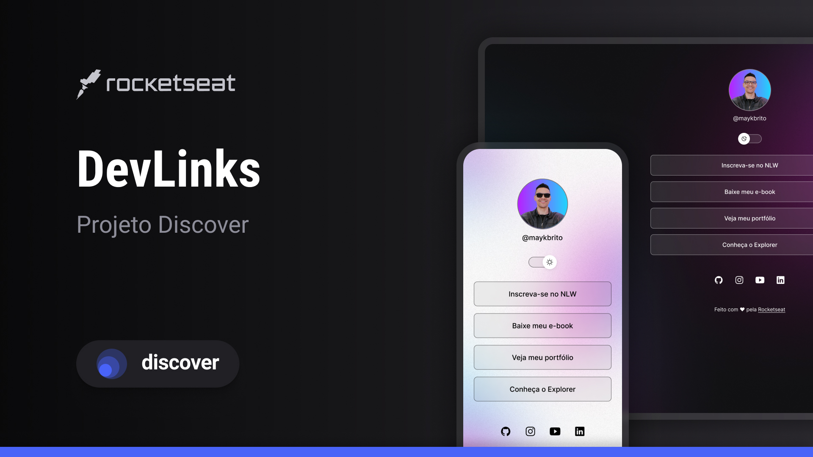

<h1 align="center"> BruManu Kids </h1>

Loja De Roupas Ifantis Com Assistencia Virtual

  <a href="#-Catálogo">Catálogo</a>&nbsp;&nbsp;&nbsp;|&nbsp;&nbsp;&nbsp;
  <a href="#-Peças">Peças</a>&nbsp;&nbsp;&nbsp;|&nbsp;&nbsp;&nbsp;
  <a href="#-Loja Virtual">Loja Virtual</a>&nbsp;&nbsp;&nbsp;|&nbsp;&nbsp;&nbsp;
  <a href="#memo-Telefone">Telefone</a>

  

 

  

## 🚀 Tecnologias

Esse projeto foi desenvolvido com as seguintes tecnologias:

- HTML e CSS
- JavaScript
- Git e Github

## 💻 Projeto

O Calendário da Copa é um projeto que mostra os jogos da Copa de 2022.

## 🔖 Layout

Você pode visualizar o layout do projeto através [DESSE LINK](https://www.figma.com/file/J1Z33MISC22YZB8wfxiIns/NLW-Copa-Explorer/duplicate). É necessário ter conta no [Figma](https://figma.com) para acessá-lo.

## :memo: Licença

Esse projeto está sob a licença MIT.

---

Feito com ♥ by Rocketseat :wave: [Participe da nossa comunidade!](https://discord.gg/rocketseat)